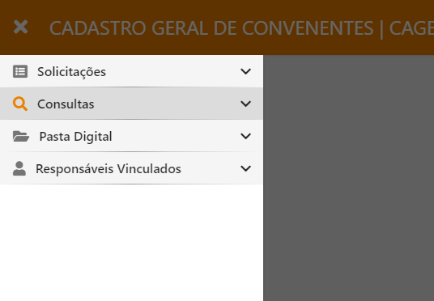
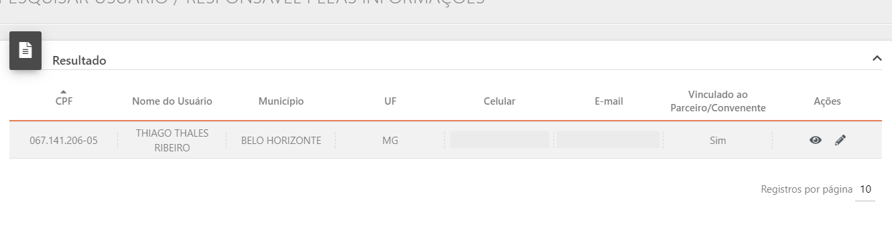
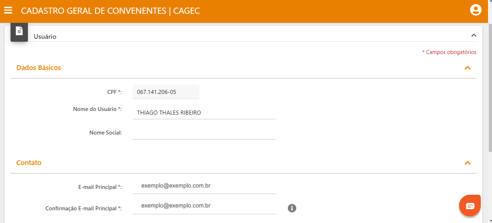
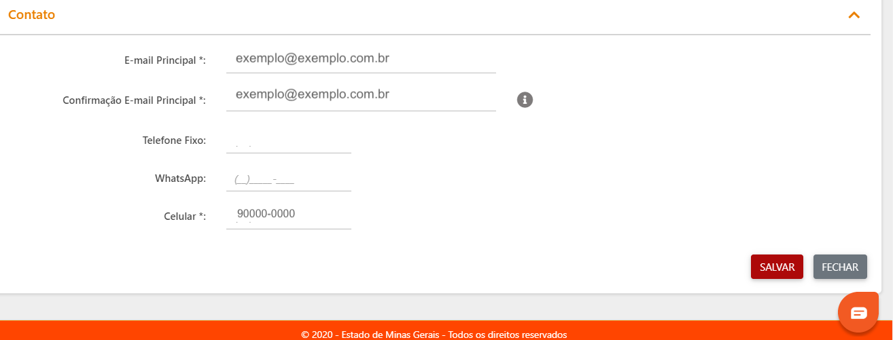

# 🖌 Alteração de Nome e e-mail de Usuário

### ⚠️  Este guia é destinado APENAS para CORRIGIR o nome do usuário no sistema. PARA ALTERAR O REPRESENTANTE LEGAL é necessário criar um novo usuário para o novo Representante Legal. 


**Em caso de alteração do Representante Legal, siga o passo a passo a seguir:**  
[https://manual.portalcagec.mg.gov.br/inscricao/inscricao-de-representante-legal](https://manual.portalcagec.mg.gov.br/inscricao/inscricao-de-representante-legal)


**1º PASSO:** Para alterar o nome do usuário acesse o [Portal do Cagec](WWW.PORTALCAGEC.MG.GOV.BR), faça login e clique nos campos de acordo com as informações ilustrados a seguir:  
  
Após logar no sistema vá até a aba "CONSULTAS"

**2º PASSO:** Busque pelo seu usuário e em seguida clique na ilustração do lápis, no canto à direita da tela:

**3º PASSO:** Após clicar no lápis aparecerá a seguinte tela:    
Nesta tela você poderá realizar a alteração do seu nome de usuário, acrescentar nome social, caso possua, e outros dados permitidos pelo sistema.

**4º PASSO:** Por fim, após a alteração dos dados, clique em "SALVAR" no canto inferior à direita da tela.

