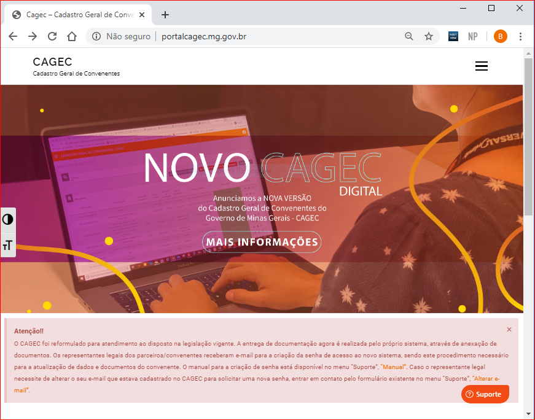
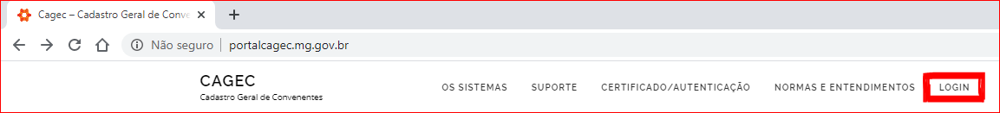

# Senha de Representante Legal Cadastrado no Sistema Anterior


Nos dias 30 e 31 de janeiro de 2020 foi encaminhado para todos os Representantes legais usuários do sistema antigo do CAGEC um e-mail com os dados e informações de acesso ao novo sistema do CAGEC. O e-mail enviado tem como remetente o endereço seg.corporativa@prodemge.gov.br

Lembramos que o endereço para o qual as informações foram enviadas é o endereço de e-mail do REPRESENTANTE LEGAL.


## **LOGIN**

**1º passo:** Acessar o Cagec conforme através do link encaminhado por e-mail.

**2º passo:** clicar no campo **ACESSO AO CAGEC**

**3º passo:** Preencher os campos **CPF** e **Senha**


O campo **CPF** deve ser preenchido com o CPF do **REPRESENTANTE LEGAL** e a **SENHA** preenchida de acordo com as instruções enviadas por e-mail.



**4º passo:** clique no ícone  e no canto superior esquerdo da página para acessar os menus de **SOLICITAÇÕES** e **CONSULTAS**

