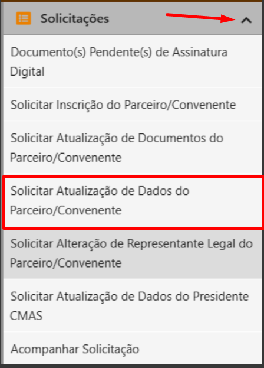

# Senha de Representante Legal Cadastrado no Sistema Anterior


Em 31 de janeiro de 2020 foi encaminhado para todos os Representantes legais usuários do sistema antigo do CAGEC um e-mail com os dados e informações de acesso ao novo sistema do CAGEF. O e-mail enviado tem como remetente o endereço seg.corporativa@prodemge.gov.br

Lembramos que o endereço para o qual as informações foram enviadas é o endereço do REPRESENTANTE LEGAL.


## **LOGIN**

**1º passo:** Acessar o [Portal Cagec](www.portalcagec.mg.gov.br) conforme instruções encaminhadas por e-mail.

**2º passo:** clicar no campo LOGIN

**3º passo:** Preencher os campos **CPF** e **Senha**


O campo **CPF** deve ser preenchido com o CPF do **REPRESENTANTE LEGAL** e a **SENHA** preenchida de acordo com as instruções enviadas por e-mail.



**4º passo:** clique no ícone no canto superior esquerdo da página:    

## RECUPERAÇÃO DE SENHA


O acesso ao Portal do Cagec é realizado através do fornecimento de CPF e senha. Caso o **Representante legal** não tenha localizado ou recebido o e-mail com sua nova senha e instruções para acesso ao novo sistema, este deverá acessar o [Portal do Cagec](www.portalcagec.mg.gov.br) e clicar nos campos descritos abaixo

