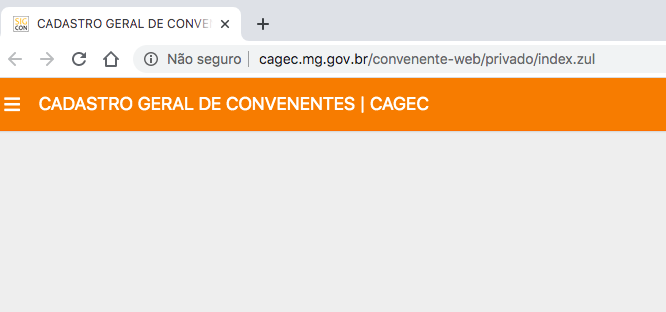
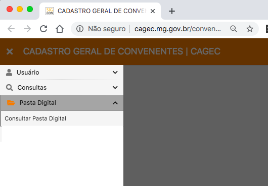
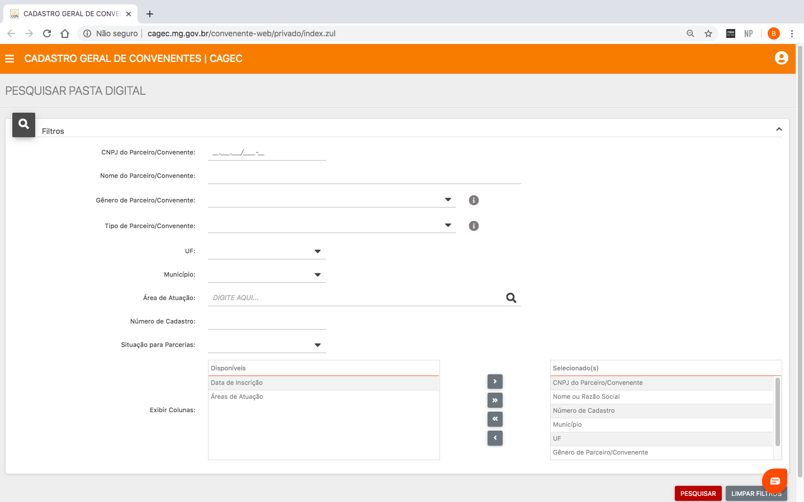
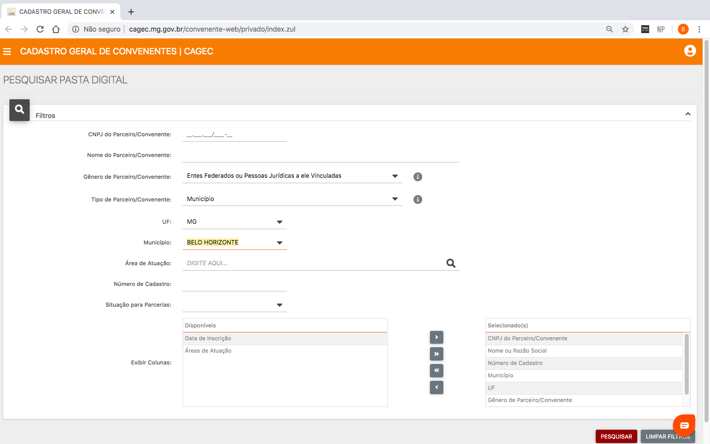
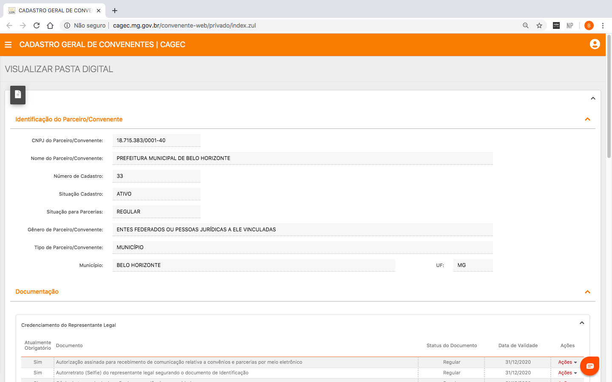
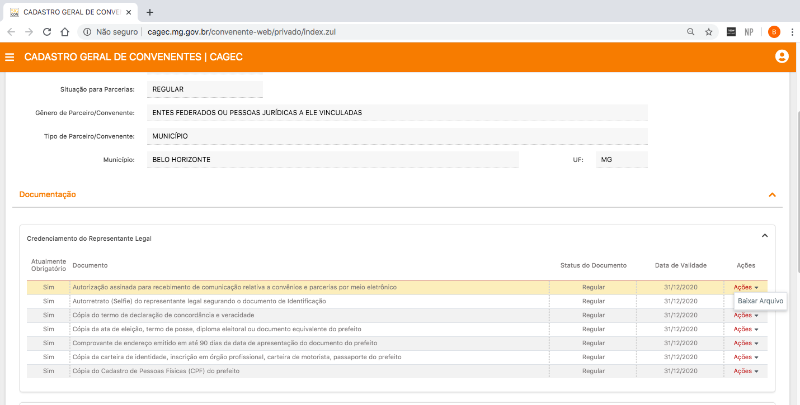

# 🗄Consultar Pastas Digitais

O Portal Cagec disponibiliza, além da Consulta ao CRC, o acesso às pastas digitais de todos os Parceiros/Convenentes cadastrados.  
O acesso à pasta digital possibilita que o usuário tenha acesso a toda a documentação encaminhada pelas entidades através de _download_  bem como a situação de Regularidade ou Irregularidade do cadastro geral ou de documentos específicos da entidade.

**1º PASSO:**   
Faça Login no [Portal Cagec ](http://www.portalcagec.mg.gov.br/)

**2º PASSO:**   
Clique em **"Pasta Digital"**, em seguida, **"Consultar pasta digital"**  

**3º PASSO:**  
Ao clicar em **"Consultar Pasta Digital"** o sistema direcionará o usuário para a página ilustrada abaixo:  
****

**4º PASSO:**  
Preencha os campos de busca de acordo com os dados da instituição a ser consultada e clique no botão **"PESQUISAR"** no canto inferior à direita da tela:

**6º PASSO:**   
Após localizar o Parceiro/Convenente pesquisado, o usuário terá acesso à documentação vigente juntada pela instituição, separada por categorias de acordo com as obrigações constantes no anexo da Resolução Conjunta SEGOV/CGE 05/2020 e suas respectivas alterações.

**7º PASSO:**   
Para visualizar o documento, clique em **"ACÕES"** em seguida em "**BAIXAR ARQUIVO"**

