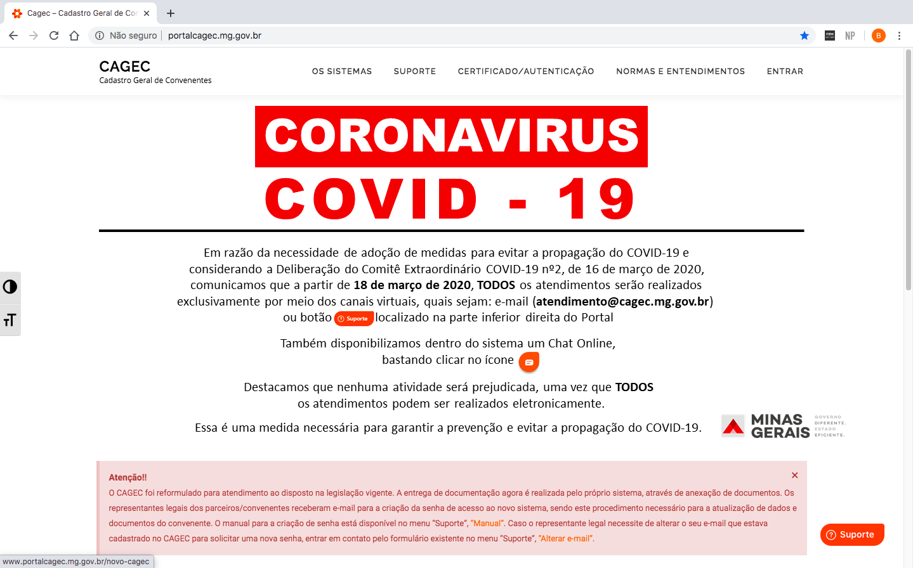
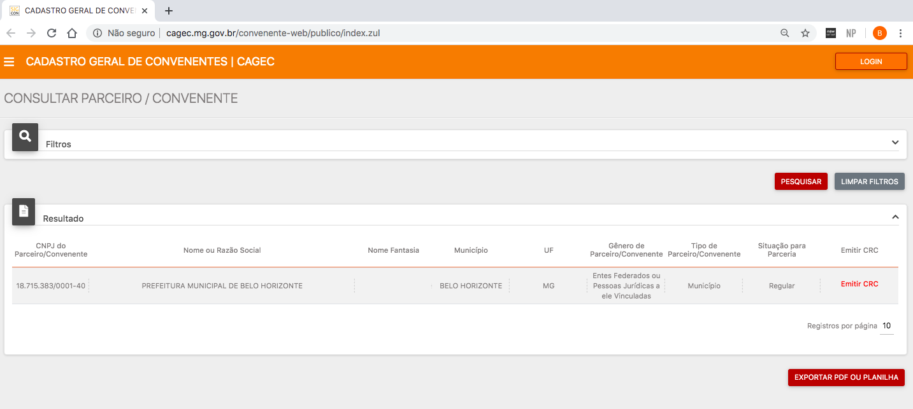

# 🔍 Emissão de CRC e Exportação de PDF ou Planilha

**1º PASSO:**\
Acesse o [Portal Cagec ](http://www.portalcagec.mg.gov.br/)

**2º PASSO:**\
Clique em **"CERTIFICADO/AUTENTICAÇÃO"** em seguida em **"CONSULTA CERTIFICADO":**

**3º PASSO:** \
Informe um ou dois campos (filtros) de pesquisa e clique no botão &#x20;

**4º PASSO:**\
Após localizar o Parceiro/Convenente pesquisado clique em EMITIR CRC" para fazer o _download_ do arquivo.

**GERAÇÃO DE RELATÓRIO POR EXPORTAÇÃO DE PDF OU PLANILHA** \
\
Para pesquisar a regularidade de um ou mais cadastros de uma única vez, preencha os dados da busca e clique no botão :   .\
⚠️ **ESTA FUNCIONALIDADE NÃO EMITE O CRC** completo do Parceiro/ Convenente pesquisado, sua função é mostrar os principais dados do cadastrado e sua situação de Regularidade ou Irregularidade.\
Através desta funcionalidade é possível a emissão de PDF ou planilha de vários cadastros em um só documento que será gerado.
