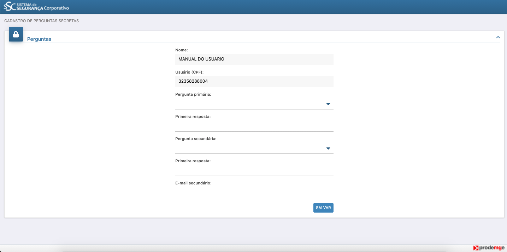
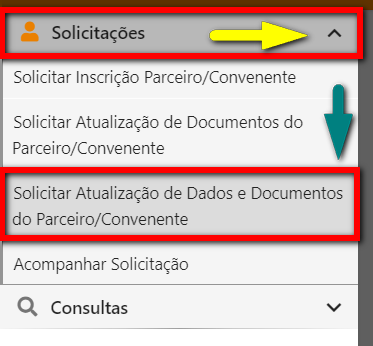

# ⌨️ Inscrição de Responsável pelas informações

## Para cadastrar usuário na modalidade de Responsável pelas Informações siga os seguintes passos: 

**1º PASSO:** Acesse o portal Cagec, passe o mouse em "Entrar" e clique em "Novo Usuário" 

**2º PASSO:** Preencha os dados \(assim como na página abaixo\) e clique em “SALVAR”



**PARA QUE A SOLICITAÇÃO DE CADASTRO SEJA SALVA, É INDISPENSÁVEL O PREENCHIMENTO DE TODOS OS CAMPOS MARCADOS COM  ''\*''\(ASTERISCO\).**


**3º PASSO:** Após clicar em salvar, aparecerá a seguinte tela

**4º PASSO:**  Após aparecer esta tela, clique no ícone “LOGIN” para acessar o menu

**5º PASSO:** Verifique a caixa de entrada do e-mail informado, clique no link: “CLIQUE AQUI PARA REALIZAR O SEU PRIMEIRO ACESSO”

**6º PASSO:** Faça login e crie uma senha de acordo com as regras expostas no quadro azul.   
⚠️ No campo **" \*Confirmação da senha atual** copie novamente a senha recebida no e-mail

**7º PASSO:** o formulário e clique em **SALVAR**

**8º PASSO:** 
Na página inicial passe o mouse em **ENTRAR** e clique em **Usuário Existente**

**9º PASSO:** 
Preencher os campos "CPF' e "Senha"

**10º PASSO:** 
clique no ícone  no canto superior esquerdo da página e no canto superior esquerdo da página para acessar   **"SOLICITAÇÕES e CONSULTAS"**

**11º PASSO:** Após clicar no ícone aparecerá a tela ilustrada logo abaixo. Nesta tela, clique no ícone de “Solicitações” e em seguida selecione a opção “Solicitar Alteração de Dados e Documentos do Parceiro/Convenente”.

#### 12º passo 

Após clicar em “Solicitar Alterações de Dados do Parceiro/Convenente”, aparecerá uma tela para buscar o convenente/parceiro que terá a atualização de dados realizada.

#### 13º passo 

Após a busca, deverá ser criada a solicitação de alteração de dados por meio do pincel destacado.

**14º passo** A partir deste ponto, o sistema exibe a possibilidade de alteração de todos os dados do convenente. A primeira tela somente exibe os dados da solicitação.

#### 15º passo

A aba “Dados do Parceiro/Convenente” permite a alteração dos dados de pessoa jurídica do CNPJ em mudança. Caso algum dado seja alterado nesta tela, o parceiro/convenente deverá necessariamente inserir documentações comprobatórias desta mudança na aba de “Documentação”, até a aprovação do cadastro, todos os documentos que necessitarem de assinatura, deverão ser assinados pelo Representante legal.   
Todas abas, daqui em diante, possuem um botão de salvar no fim delas e esta atividade é **indispensável** para que os dados sejam registrados no sistema.

##                                        ⚠️Atenção!

No campo " DATA DE ABERTURA", o dado a ser preenchido é a data de abertura  do Convenente/Parceiro de acordo com a Inscrição no CNPJ.

#### 16º passo

A aba “Quadro de Dirigentes” permite alterações dos dados do representante legal e do quadro de dirigentes, sendo este último de preenchimento necessário apenas para o gênero “Organizações da Sociedade Civil”, gênero “Fundos Municipais” e gênero “Serviços Sociais Autônomos”. As edições e exclusões são feitas pelos ícones de “pincel” e “lixeira”, respectivamente, dentro da coluna ações.

#### 17º passo

Na aba “Áreas de Atuação”, o sistema solicita o cadastro dos CNAEs do parceiro/convenente, bem como a seleção de áreas de atuação. Para parceiro/convenente do gênero “Entes Federados ou Pessoas Jurídicas a ele Vinculadas” o sistema já insere todas as áreas de atuação automaticamente. Os CNAEs podem ser buscados através da inscrição do CNPJ, sendo que para o gênero “Entes Federados ou Pessoas Jurídicas a ele Vinculadas” o número é sempre 8411-6/00, cuja descrição é “Administração pública em geral”.

#### 18º passo

A principal aba de qualquer solicitação, “Documentação”, é onde o usuário faz o upload dos documentos e declara sua autenticidade. Esta é a principal novidade do novo Cagec, pois com a declaração pelo representante legal da autenticidade de tudo que foi anexado ao processo, o que dispensa as autenticações em cartório cobradas anteriormente. Ressaltamos apenas que o registro dos estatutos e normas de constituição continuam sendo obrigatórios, mas a autenticação dos documentos em si não. No caso de alteração de dados, o campo inicia-se vazio e toda a documentação do tipo de convenente pode ser incluída no processo.

#### 19º passo

Para que as assinaturas digitais sejam válidas, é necessário que pelo menos os documentos “Autorretrato \(Selfie\) segurando o documento de identificação”, “Documento de Identificação do Responsável pelas informações” e “Termo de Declaração de Concordância e Veracidade **assinados pelo Representante Legal** ” sejam anexados ao sistema. Todos eles encontram-se no agrupamento “Credenciamento do Representante Legal”.

Na aba de incluir documento, selecionar o agrupamento desejado:

Clicar no botão "Filtrar":

Selecionar o documento desejado, lembrando que o sistema só possibilita a inserção de um documento por vez ou de todos ao mesmo tempo:

Clicar na primeira seta para inserir o documento:

Refazer a operação até que todos os documentos desejados estejam selecionados e clicar no botão salvar:

Ou então, apertar o botão marcado abaixo para transportar todos os documentos de uma só vez:

Para a anexação de documentos no sistema, o usuário deverá clicar no botão "Ação" e posteriormente na opção "Entregar Digitalmente":

O usuário, então, irá escolher o arquivo a ser anexado e inserirá, na maior parte dos casos, a data de validade do mesmo. Cabe ressaltar que documentos que naturalmente não possuem data de validade, tais como inscrição do CNPJ, estatuto de organizações da sociedade civil, identificação do representante legal, por força da Resolução Conjunta SEGOV/CGE nº 05/2020, possuem como data de validade a data do término do mandato do representante legal.

#### 20º passo 

Além da anexação, alguns documentos são gerados pelo próprio sistema e só necessitam de assinatura do representante legal. Para esta assinatura, o usuário deve ir também na coluna de ações, escolher a opção “Assinar Digitalmente”, e neste momento de estabilização do sistema recomendamos a opção “Assinar com usuário/senha”.

#### 21º passo

O documento “Termo de Declaração e Concordância e Veracidade” possui uma especificidade em relação aos demais documentos. Para que o documento tenha sua anexação permitida, ele exige primeiro o download no sistema para posterior anexação.

Após a impressão e assinatura pelo representante legal, o documento deve ser anexado ao sistema seguindo a mesma lógica descrita no item 13.

Por fim, após a anexação e a assinatura dos documentos o parceiro/convenente deverá clicar no botão finalizar solicitação, onde será gerado o número da mesma e o processo é encaminhado para avaliação da equipe gestora do Cagec.

#### 22º passo

Assim, encerra o fluxo do parceiro/convenente se encerra nesta etapa. O convenente pode verificar o andamento de sua solicitação através do menu “Solicitações”, “Acompanhar Solicitação”. Também pelo mesmo menu é possível que o parceiro/convenente edite solicitações que não tenham sido finalizadas, bem como que faça correções solicitadas pelos analistas da equipe gestora do Cagec.

