# 🖥 Inscrição de Parceiro Convenente

#### Esta funcionalidade é destinada a qualquer usuário do Portal Cagec vinculado a mais de uma pessoa jurídica. O Cagec não permite que um mesmo CPF possua mais de um cadastro, entretanto, você pode ser vinculado a várias Pessoas Jurídicas diferentes, seja como Representante Legal ou Responsável pelas Informações. 

### Para Inscrever um parceiro/convenente siga o passo a passo a seguir:

**1º PASSO:** Acesse o portal Cagec, e faça login com seu usuário e senha 

**2º PASSO:** Após o login, clique em **"Solicitações",** em seguida clique em "**Solicitar inscrição Parceiro/Convenente"**

**3º PASSO:** Preencha o campo a seguir com o CNPJ da Pessoa Jurídica a ser cadastrada

**4º PASSO:** O sistema mostrará a página demonstrada abaixo, não é preciso preencher nenhum campo nesta página. Clique na aba seguinte "Dados do Parceiro/Convenente"

**5º PASSO:** Preencha os campos, especialmente os os marcados com \* que são de preenchimento obrigatório

**6º PASSO:** Escolha a **Natureza Jurídica** de acordo com a busca disponível na página

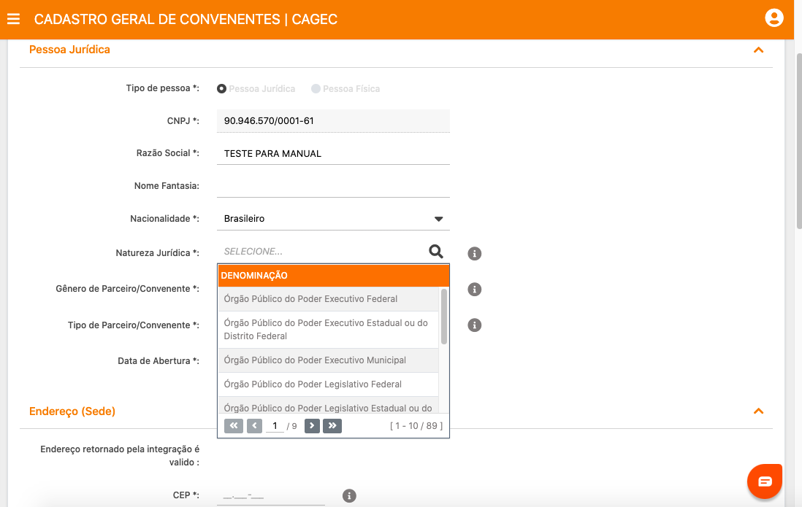

**7º PASSO:** Preencha os dados da Sede da Instituição.  
⚠️ **IMPORTANTE:** O endereço da instituição precisa ser o mesmo constante no cartão do CNPJ e no Estatuto

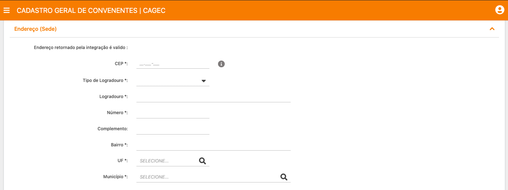

**8º PASSO:** Após preencher todos os dados clique em "SALVAR 

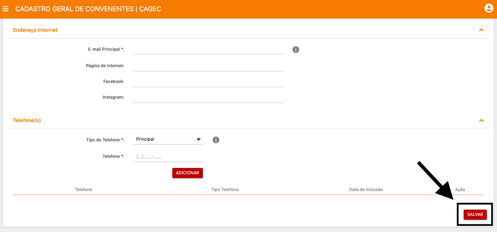

**9º PASSO:** Na aba "Quadro de dirigentes" clique em **"INCLUIR"** para adicionar o Representante Legal e abaixo, os membros do "Quadro de dirigentes 

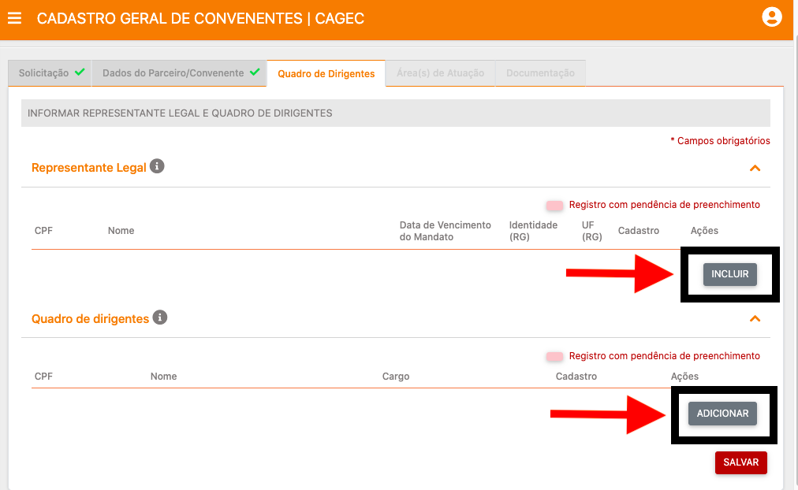

**10º PASSO:** Ao cadastrar o **"REPRESENTANTE LEGAL"** preencha todos os dados, em seguida  **anexe os documentos** para o Credenciamento do Representante Legal e clique em "**SALVAR"**

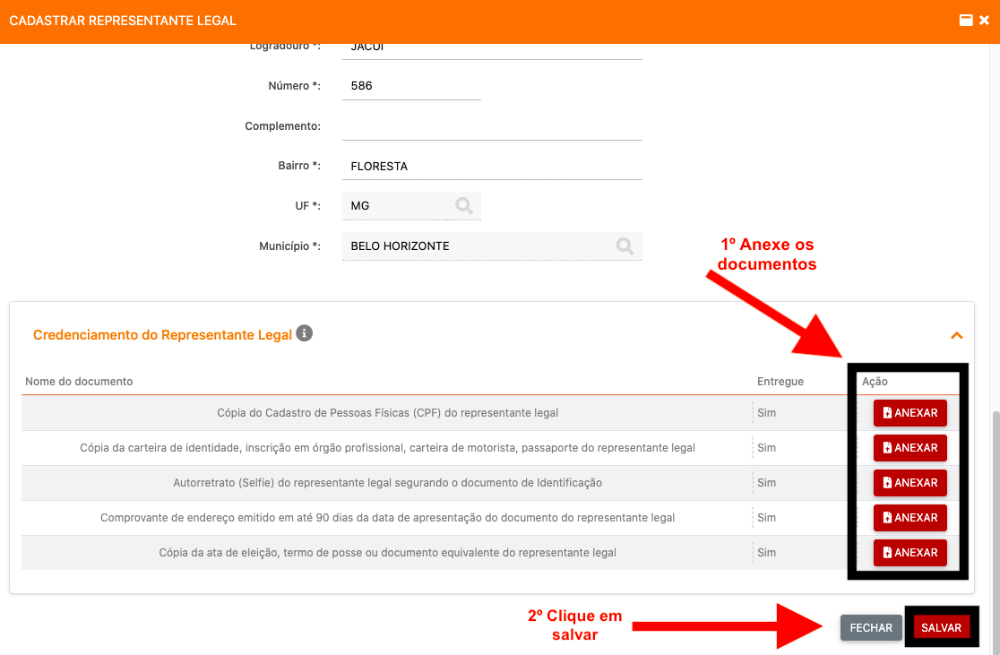

**11º PASSO:** Após cadastrar o Representante Legal, **cadastre TODOS os dirigentes da instituição, ao final clique em "SALVAR"**

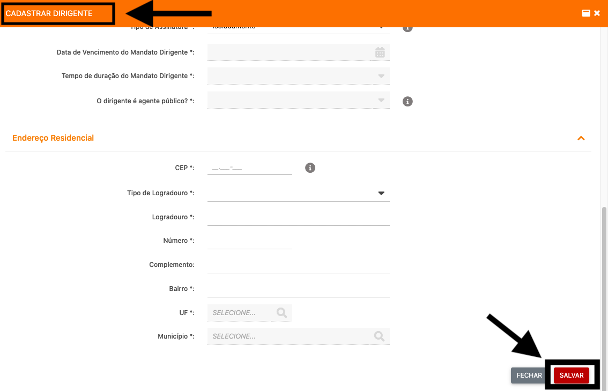

**12º PASSO:** Na aba "ÁREA\(S\) DE ATUAÇÃO", **1º adicione as Atividades Desenvolvidas** de acordo com o Cartão do CNPJ, **2º adicione as Áreas de Atuação** de acordo com as opções disponíveis.

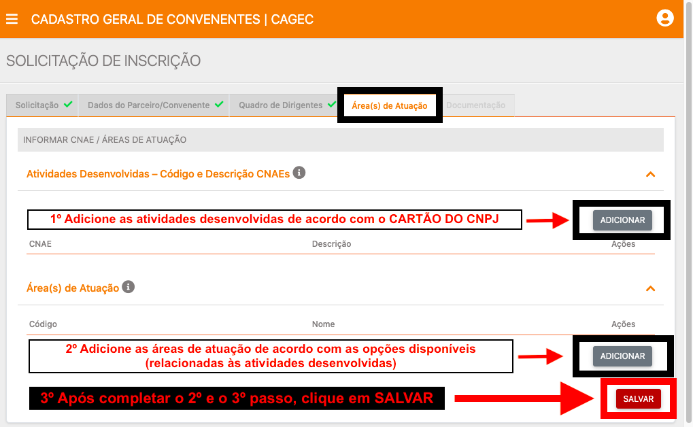

**13º PASSO:** Preencha as Atividades Disponíveis \(relação de CNAE\) de acordo com o\(s\) código\(s\) CNAE constante no Cartão do CNPJ, em seguida clique em **"SALVAR"**

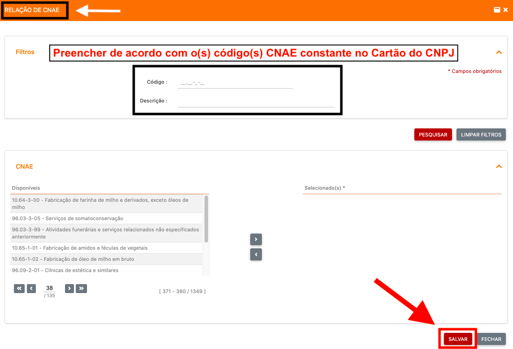

**14º PASSO:** Preencha a\(s\) área\(s\) de atuação de acordo com a imagem abaixo, ao final, clique em **"SALVAR"**

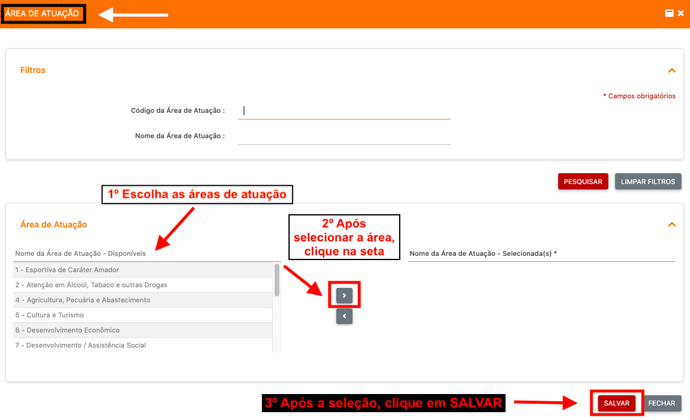

**15º PASSO:** Na aba documentação, anexe os documentos marcados de rosa, ou os marcados como "não entregue"

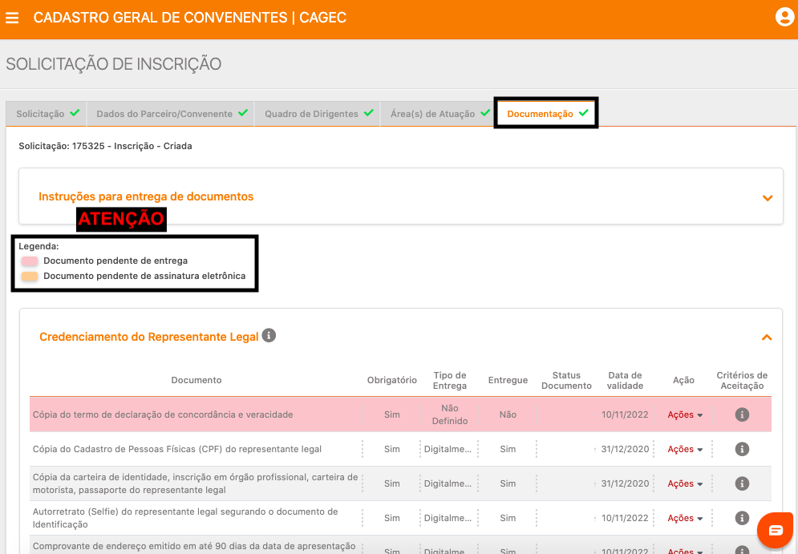

**16º PASSO:** Após juntar todos os documentos e assinar as declarações clique em **"ENCAMINHAR SOLICITAÇÃO PARA ANÁLISE**

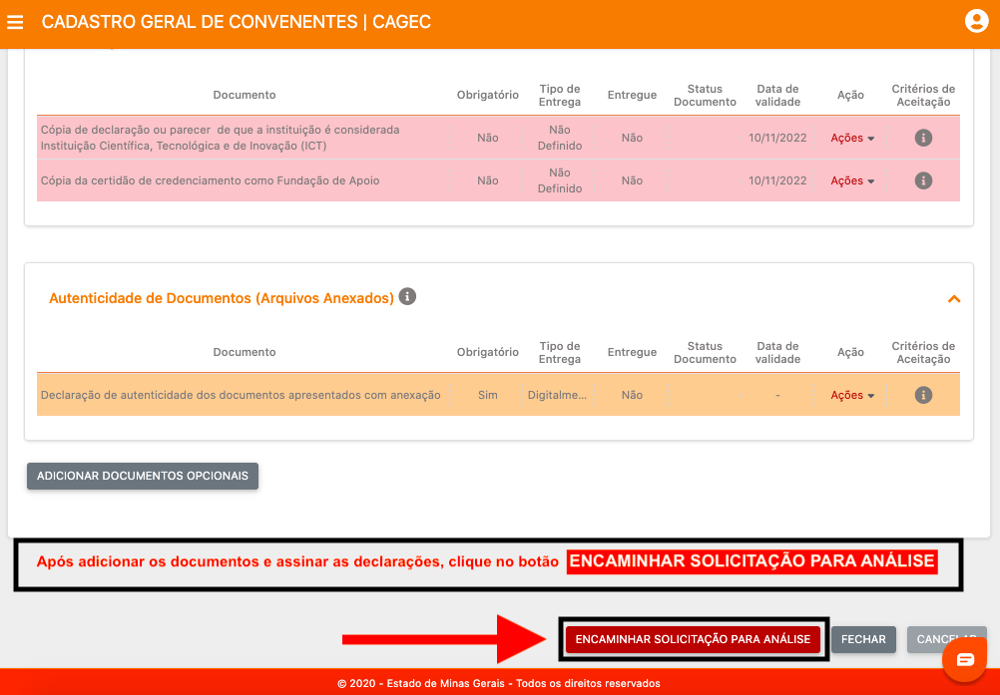


⚠️ **ATENÇÃO:**   
**Até que a solicitação seja**  _**ENCAMINHADA PARA ANÁLISE**_ **ela ficará no status de** _**CRIADA**_ **e não poderá ser analisada pela equipe do CAGEC.  
  
Caso a solicitação não seja** _**ENCAMINHADA PARA ANÁLISE**_ **em até 14 dias úteis após a sua criação, o sistema a excluirá automaticamente.**


