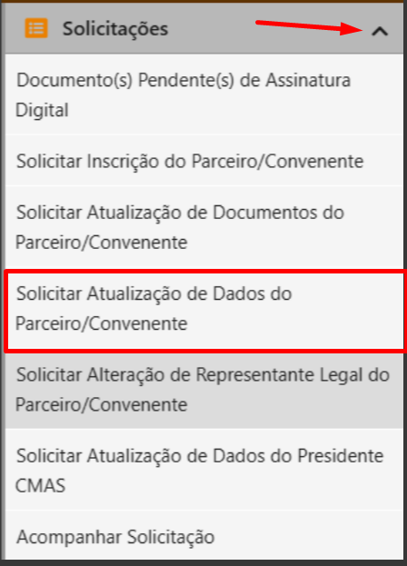

# ⌨️ Acesso com GOV.BR

O sistema do CAGEC pode ser acessado pelo [**GOV.BR**](https://www.gov.br/pt-br)**.**&#x20;


Para acessar, é necessário possuir cadastro no [GOV.BR](https://www.gov.br/governodigital/pt-br/conta-gov-br).

[**Clique aqui** para acessar o tutorial de cadastro.](https://www.gov.br/governodigital/pt-br/conta-gov-br/conta-gov-br/)


**1.** Acesse o portal CAGEC e clique em `"Entrar > Usuário Existente"`&#x20;

<figure><figcaption></figcaption></figure>

**2.** Clique no em `“entrar com gov.br”`

<figure><figcaption></figcaption></figure>

**3.** Na página aberta, digite o CPF e clique em `"Continuar"`

<figure><figcaption></figcaption></figure>

**4.** Em seguida, digite a senha e clique em `"Entrar"`

<figure><figcaption></figcaption></figure>

**5.** Insira o código de acesso que você recebeu no celular e clique em `"Ok"`

<figure><figcaption></figcaption></figure>

**6.** Você será redirecionado para o sistema do CAGEC

<figure><figcaption></figcaption></figure>
