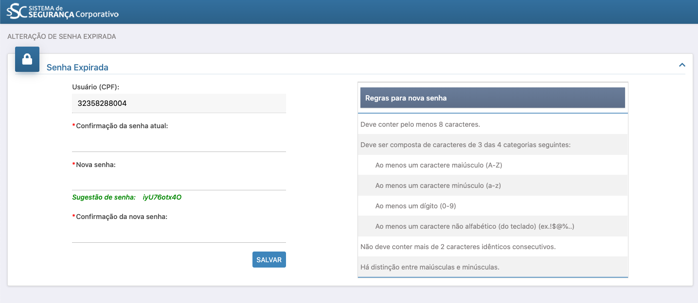
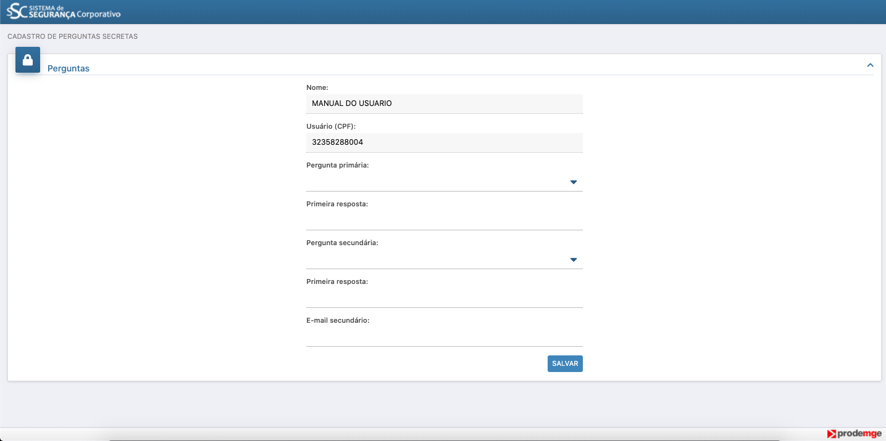

# ⌨️  Validação de Cadastro

### Esse passo a passo é **DESTINADO aos usuários que receberam em 31 de janeiro de 2020 um e-mail com o login senha e instruções para logar no Portal Cagec.**

 **Finalidade:** Celebração e liberação de recursos de Convênio de Saída, Termo de Colaboração, Termo de Fomento, Acordo de Cooperação, Contrato de Gestão com Serviços Sociais Autônomos e, conforme previsão na legislação específica, outros instrumentos jurídicos congêneres envolvendo a transferência de recursos financeiros de dotações consignadas no orçamento fiscal Poder Executivo do Estado de Minas Gerais.

## 🔑 Como um Representante Legal Cadastrado no Sistema Anterior acessa o Portal Cagec?

#### Siga o passo a passo a seguir:


Nos dias 30 e 31 de janeiro de 2020 foi encaminhado para todos os Representantes Legais usuários do sistema antigo do CAGEC um e-mail com os dados e informações de acesso ao novo sistema do CAGEC. O e-mail enviado tem como remetente o endereço seg.corporativa@prodemge.gov.br

**⚠️ O endereço para o qual as informações foram enviadas é o endereço de e-mail do REPRESENTANTE LEGAL cadastrado anteriormente.**


## **LOGIN**

**1º passo:** Acessar o Cagec conforme instruções encaminhadas por e-mail remetido pela Prodemge em 31 de janeiro de 2020

 **2º PASSO:** Após acessar o e-mail e ter acesso aos dados para o login, clique em " clique aqui para realizar o seu primeiro acesso".  
Faça login e crie uma senha de acordo com as regras expostas no quadro azul.   
⚠️ No campo **" \*Confirmação da senha atual** copie novamente a senha recebida no e-mail

**3º PASSO:** o formulário e clique em **SALVAR**

**4º passo:** passe o mouse no campo **ENTRAR** e depois clique em **USUÁRIO EXISTENTE**

**5º passo:** Preencher os campos **CPF** e **Senha**


O campo **CPF** deve ser preenchido com o CPF do **REPRESENTANTE LEGAL** e a **SENHA** preenchida de acordo com as instruções enviadas por e-mail.



**6º passo:** clique no ícone  e no canto superior esquerdo da página para acessar   **"SOLICITAÇÕES e CONSULTAS"**

