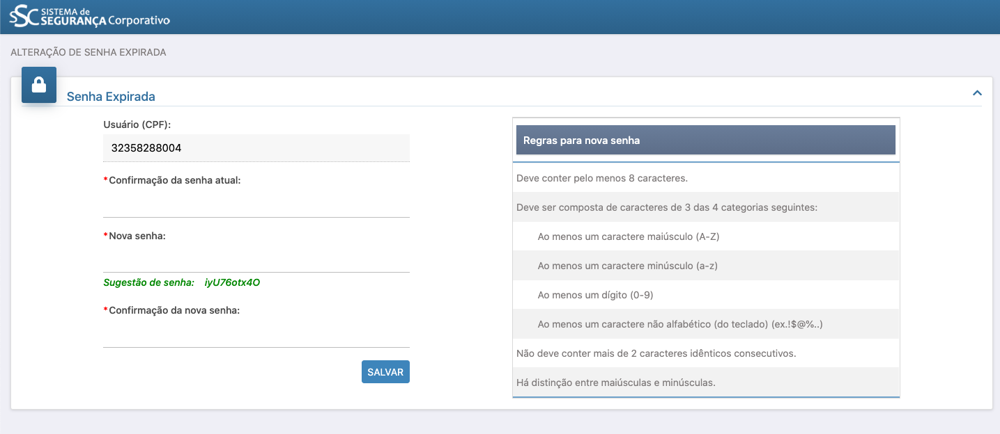

# ⌨️ Cadastro de usuário

### Este guia visa demonstrar como é o processo de Cadastro. 

**O CADASTRO** é a fase inicial para um Representante Legal, Responsável pela informação ou qualquer pessoa física que desejar ser um usuário do sistema.

**1º PASSO:** Acesse o portal Cagec, passe o mouse em "Entrar" e clique em "Novo Usuário" 

**2º PASSO:** Preencha os dados \(assim como na página abaixo\) e clique em “SALVAR”



**PARA QUE A SOLICITAÇÃO DE CADASTRO SEJA SALVA, É INDISPENSÁVEL O PREENCHIMENTO DE TODOS OS CAMPOS MARCADOS COM  ''\*''\(ASTERISCO\).**


**3º PASSO:** Após clicar em salvar, aparecerá a seguinte tela

**4º PASSO:**  Após aparecer esta tela, clique no ícone “LOGIN” para acessar o menu

**5º PASSO:** Verifique a caixa de entrada do e-mail informado, clique no link: “CLIQUE AQUI PARA REALIZAR O SEU PRIMEIRO ACESSO”

**6º PASSO:** Faça login e crie uma senha de acordo com as regras expostas no quadro azul.   
⚠️ No campo **" \*Confirmação da senha atual** copie novamente a senha recebida no e-mail

**7º PASSO:** o formulário e clique em **SALVAR**

**8º PASSO:** 
Na página inicial passe o mouse em **ENTRAR** e clique em **Usuário Existente**

**9º PASSO:** 
Preencher os campos "CPF' e "Senha"

