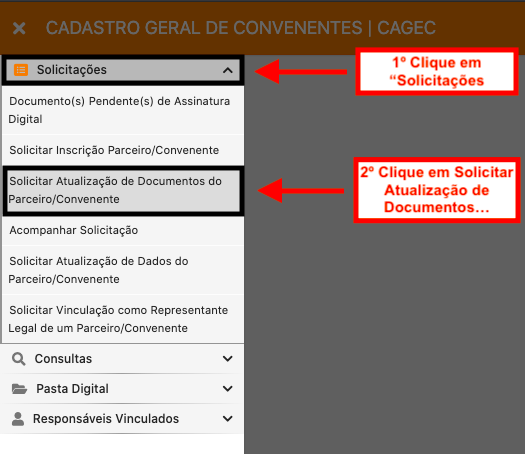

# 🔄 Solicitar Atualização de DOCUMENTOS do Parceiro/Convenente

Este fluxo possibilita que o usuário anexe DOCUMENTOS do parceiro/convenente.

#### 1º PASSO:

Para solicitar atualização de dados é necessário acessar o portal Cagec no endereço eletrônico: [**http://www.portalcagec.mg.gov.br/**](http://www.portalcagec.mg.gov.br) e adotar as instruções ilustradas a seguir:

.png>)

#### 2º PASSO:

Faça o Login no sistema Cagec

.png>)

#### 3º PASSO:

1º Clique em "Solicitações", em seguida clique em "Solicitar Atualização de Documentos do Parceiro/Convenente"

#### 4º PASSO:

Selecione a Pessoa Jurídica, em seguida clique no ícone do lápis para criar a solicitação

.png>)

#### 5º PASSO:

Clique em "ADICIONAR DOCUMENTO"

.png>)

#### 6º PASSO:

Selecione o(s) documento(s) na coluna **"DISPONÍVEIS"**, clique na seta para que o documento vá para a coluna **"SELECIONADOS"**,  em seguida clique em **"SALVAR**

.png>)

#### 7º PASSO:

**ANEXE** o documento (tamanho limite de 20Mb), em seguida **informe a data de validade** do documento e clique em **"SALVAR"**

.png>)

#### 8º PASSO:

Após adicionar o(s) documento(s) é necessário assinar a **"DECLARAÇÃO DE AUTENTICIDADE DOS DOCUMENTOS APRESENTADOS COM ANEXAÇÃO".** Clique em **"AÇÕES"** em seguida em **"Assinar Digitalmente"**&#x20;

.png>)

#### 9º PASSO:&#x20;

O sistema mostrará a declaração, role até o fim da página, selecione a opção **"ASSINAR COM USUÁRIO E SENHA**&#x20;

⚠️ Para assinar digitalmente qualquer documento, é necessário que o **login** seja realizado através do **usuário e senha do Representante Legal,** bem como, ao selecionar a opção **"ASSINAR COM USUÁRIO E SENHA"**, **preencha os campos para assinatura com o usuário e login do Representante Legal.**

.png>)

#### 10º PASSO:&#x20;

Após a assinatura, clique em **ENCAMINHAR SOLICITAÇÃO PARA ANÁLISE**

.png>)
